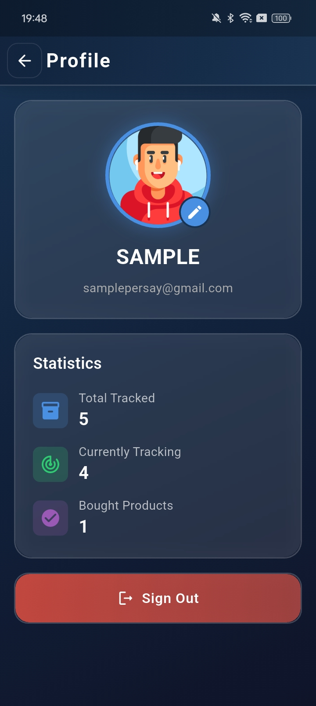
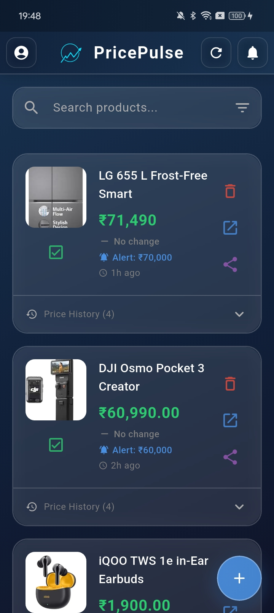
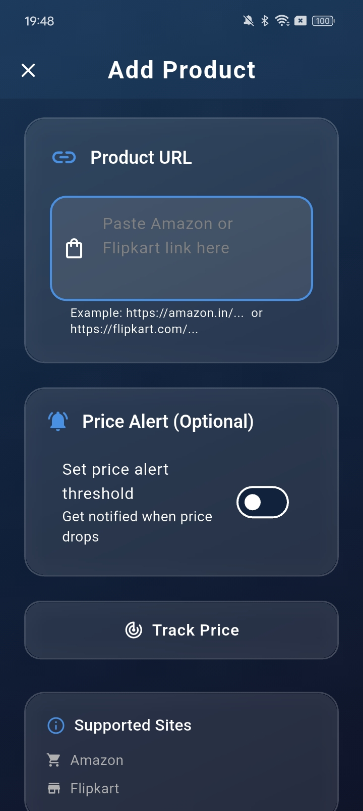

# 🛒 Price Pulse – Smart Price Tracker

Price Pulse is a clean and modern **Flutter app** that helps users **track product prices over time**, monitor drops, and make smarter buying decisions.

## ✨ Features
- Track products and price changes
- Get alerts when prices drop
- Store history locally (Hive)
- Smooth UI and fast performance

## 🛠 Tech Used
- **Flutter (Dart)**
- **Hive Database**
- Local Notifications

## 📸 Screenshots
<p>
  
  
  
  
</p>


## 📥 Download APK

[⬇️ Download Latest APK](https://github.com/Muthunilavan-D/Pricepulse/releases/download/v1.0.0/price-pulse-app-release.apk)
[](https://github.com/Muthunilavan-D/Pricepulse/releases)


## 🚀 Run Locally
```bash
flutter pub get
flutter run
```

## 💡 Future Enhancements
- Real API integration
- Analytics trends
- Cloud Sync

---
**Made with ❤️ in Flutter**
